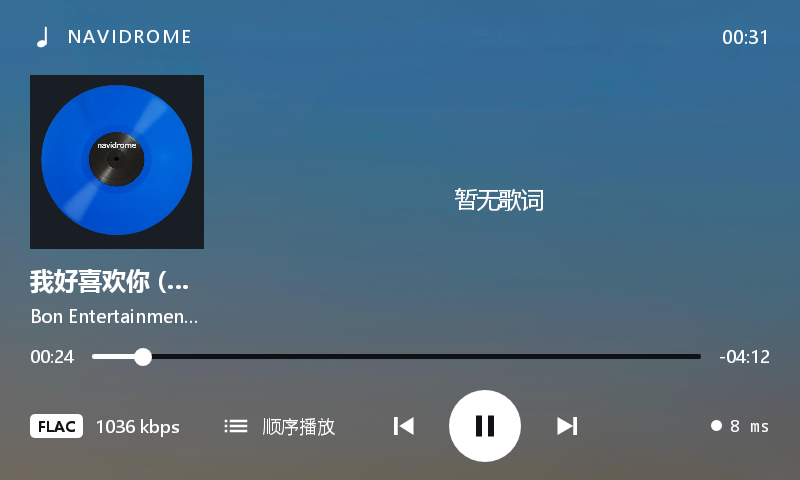
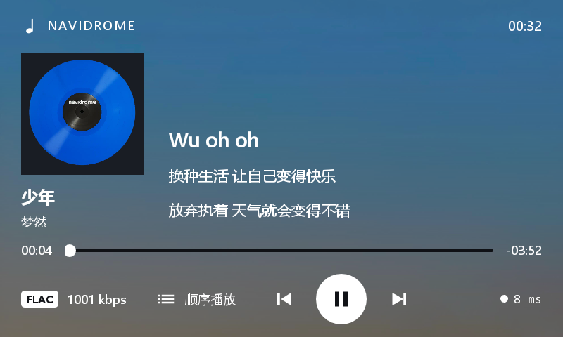
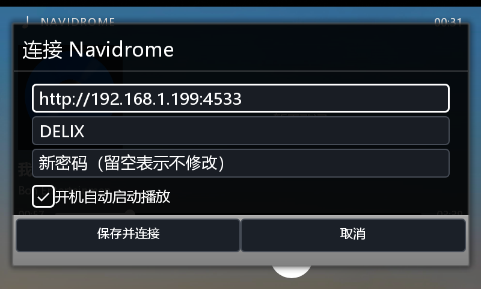
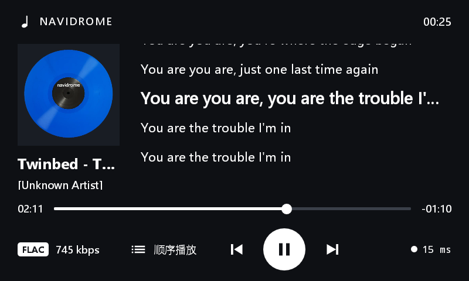
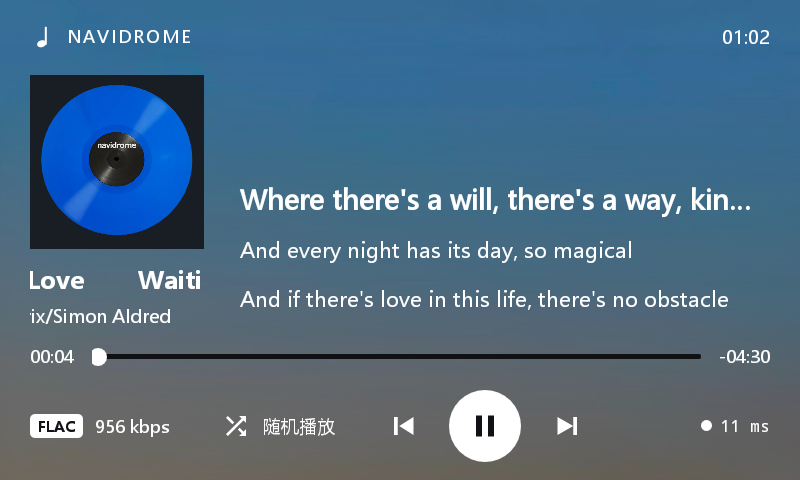

# NaviPlayer · 小米小爱触屏音箱 LX04 的 Navidrome 播放器

一个为**低对比度小屏**（800×480、240dpi、Android 8.1、armeabi-v7a 纯 32 位）极致取舍的极简
局域网音乐播放器：连接 [Navidrome](https://www.navidrome.org)（兼容 Subsonic API），
只做「封面 + 歌词 + 上一曲/下一曲 + 随机/顺序」这一件事。



## 功能

| 功能 | 说明 |
|---|---|
| 歌词同步 | Navidrome 内嵌/文本歌词 → [LRCLIB](https://lrclib.net) 补时间轴，逐行高亮滚动；无歌词显示「暂无歌词」 |
| 跑马灯 | 歌名/歌手名超宽时左右循环滚动，未超宽完全静止；首尾各停 1.4s，无缝循环不闪 |
| 格式/码率 | 底部白底深字格式徽章（FLAC/MP3）+ 实时码率，读服务端原始文件参数 |
| 服务器状态 | 每秒探测一次 `ping.view`：白点在线 / 红点离线 / 灰点未连接，实时显示往返延迟 |
| 后台播放 | 前台服务 + 音频焦点 + WakeLock，息屏可长时间播放 |

| 主界面与歌词 | 服务器配置 |
|---|---|
|  |  |

| 状态条 | 跑马灯（滚动中的歌手名片段） |
|---|---|
|  |  |

## 构建（无 Gradle，纯命令行离线链）

依赖：**JDK 17+**、**Android SDK**（build-tools 34 + platform android-34，或更高）、**Python 3**。
不需要 Gradle / Android Studio。

```bash
# 1. 告诉脚本本机的 SDK / JDK 位置（二选一）
#    方式 A：仓库根目录建 local.properties
#        sdk.dir=C:\\path\\to\\Android\\Sdk
#        jdk.dir=C:\\path\\to\\jdk-17
#    方式 B：环境变量 ANDROID_HOME 与 JAVA_HOME

# 2. 构建
python build.py            # 产出 build/naviplayer.apk

# 3. 装机 + 启动 + 截图（可选，需 adb 与已开启 USB 调试的设备）
python deploy.py shot.png
```

**签名**：仓库不包含签名密钥。首次构建时若根目录没有 `navi.jks`，
脚本会用 keytool 自动生成一把自签测试密钥（别名 `navi`，口令 `android`），
也可放入你自己的 keystore 后修改 `build.py` 里的签名参数。

**单元测试**（纯 JVM，无需设备）：

```bash
python build.py            # 先构建出 build/obj
javac -cp build/obj -d build/obj test/LrcTest.java
java  -cp build/obj LrcTest
```

## 首次使用

应用启动后**长按顶栏**打开服务器配置，填入 Navidrome 地址（如 `http://192.168.1.10:4533`）、
用户名、密码，勾选播放模式即可。凭据保存在应用私有目录（`allowBackup=false`，不随备份导出）。

## 目录结构

```
├── AndroidManifest.xml
├── src/com/tongsir/naviplayer/    # 全部 Java 源码（10 个类）
│   ├── PlayerService.java         # 播放服务：队列/焦点/歌词调度/延迟探测
│   ├── MainActivity.java          # 界面：绑定/状态条/服务器配置对话框
│   ├── SubsonicClient.java        # Subsonic API 客户端（MD5 token 认证）
│   ├── LrcSource.java             # 歌词五级回退 + LRCLIB + 磁盘缓存
│   ├── LrcParser.java             # LRC 解析（offset / 无时间轴过滤）
│   ├── LyricView.java             # 歌词自绘控件（状态机）
│   ├── MarqueeTextView.java       # 超宽才滚的跑马灯控件
│   └── ...
├── res/                           # 资源（布局/矢量图/多密度图标/背景图）
├── test/LrcTest.java              # 歌词解析单元测试（24 断言）
├── docs/                          # 实机截图
└── *.py                           # 构建 / 部署 / 视觉回归脚本（见下）
```

## 辅助脚本

| 脚本 | 用途 |
|---|---|
| `devpath.py` | 工具链路径解析（SDK/JDK/adb），全仓库不写死绝对路径 |
| `build.py` | 离线构建：aapt2 → javac → d8 → zipalign → apksigner |
| `deploy.py` | 装机 + 启动 + 截图：`python deploy.py [名字.png]`（`--shot` 只截图） |
| `bgmake.py` | 从源图生成主界面背景：逐行自适应压暗，保证白字对比度 ≥ 4.5:1 |
| `mkicon.py` | 零依赖图标生成器（多密度 launcher 图标 / 顶栏 logo） |
| `marqueecheck.py` | 跑马灯实测：`locate` / `still` / `seek` / `track` / `both` / `gif` / `stability` |
| `statcheck.py` | 底部状态条视觉回归（延迟区每秒变化、歌曲信息区不变的帧级验证） |
| `dlgshot.py` | 服务器配置对话框四态截图（视觉回归） |
| `pxcheck.py` | 零依赖 PNG 像素采样（文字颜色核验） |
| `libwidth.py` | 从 Navidrome 抽样统计哪些歌名/歌手名会触发跑马灯 |

## 设计约定（改界面必读）

- 这块屏对比度偏低：**所有文字一律纯白 `#FFFFFF`**，禁止灰阶/半透明做层级；
  背景图由 `bgmake.py` 逐行压暗到白字对比度达标后才可用，**不要为好看调亮背景**。
- 彩色只允许出现在图形元素上（状态圆点），文字不用颜色。
- 布局以 4dp 网格为准（`res/values/dimens.xml`），底部控制行「左右容器等 weight」
  保证中间按钮组精确居中，改这里务必复测按钮中心。

## 已知限制

- API 27 无系统歌词接口，进度条为 250ms 轮询（实测够用）。
- 歌词时间轴依赖 LRCLIB，冷门中文歌命中率低（会回落到「暂无歌词」）。
- Subsonic 协议要求客户端持有明文口令（MD5 token 认证），凭据存应用私有目录。
- 主要在 LX04 上验证；其他 Android 5.0+ 设备理论上可运行，未逐一测试。

## 许可证

尚未指定。个人使用与修改随意；如需引用代码请先开 issue 联系。
